# HOMEWORK 2 AREM (Heroku: Intérpretes, canales de comunicación y memoria)

### Use Maven,HEROKU,GIT,Spark and GITHUB.

Write a program to calculate the mean and standard deviation of a set of n real numbers (Web Page)

# DOCUMENTATION

[Tarea 2 - Arep (LaTeX)](/Tarea2Arep.pdf)

# DESIGN
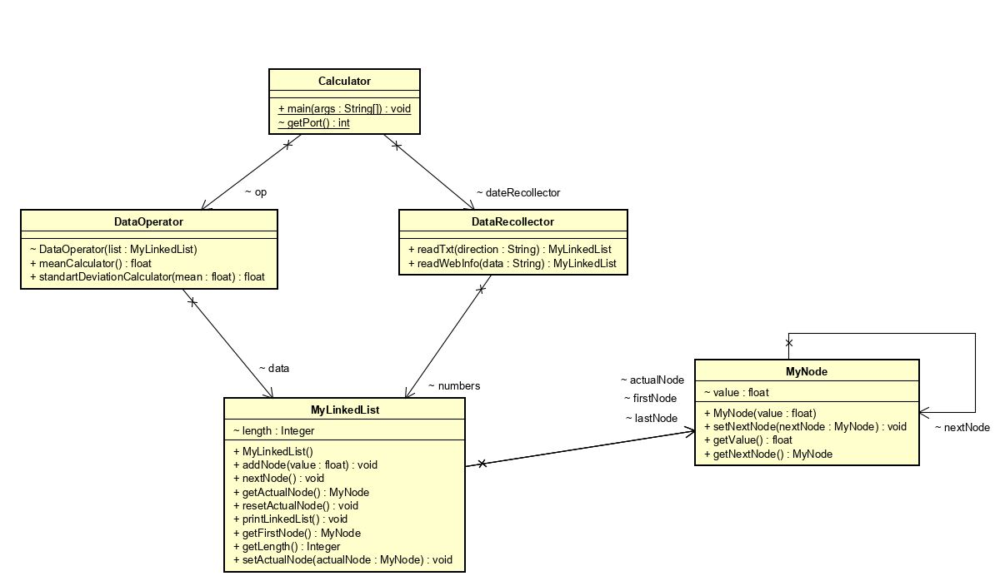

# START

Copy the project through git clone in any direction to start working:
```
git clone https://github.com/Juaco9502/Dise-o-de-conceptos-basicos---AREP
```

## PRE-REQUISITES

* Java jdk > 7
* Maven (Apache Maven)
* Git
* Spark

## INSTALL

1. Run in terminal:

```
$$ mvn package
```
2.(Optional):
If you want to view the documentation of the application, execute the following command and check the following path: root / target / site / apidocs:

```
mvn javadoc:javadoc
```

3. (Run):
The following command must be used in the project root folder:
  
```
java -jar target/SparkWebApp-1.0-SNAPSHOT-jar-with-dependencies.jar

```
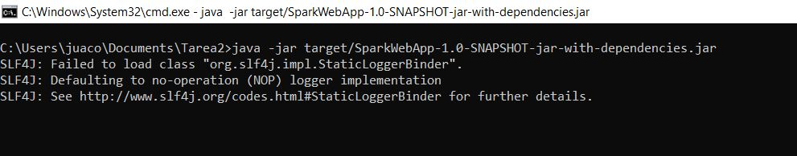


4. (Server):
Once compiled, the program runs on port 4567, to test it go to this address from your browser:
  
```
http://localhost:4567/input

```
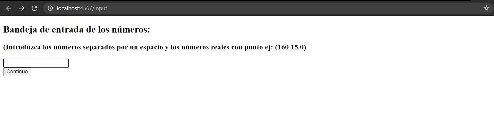
  
## TEST REPORT

## TEST CASES

## TEST 1 
INPUT | OUTPUT
------------ | ------------- 
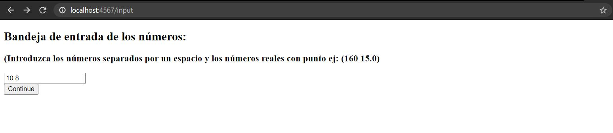 | 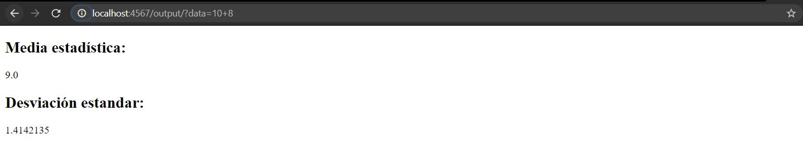
En esta prueba se ingresaron valores enteros| 

## TEST 2
INPUT | OUTPUT
------------ | ------------- 
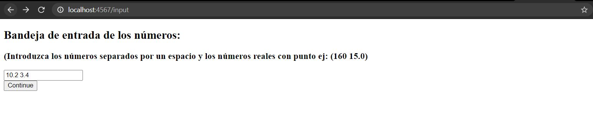 | 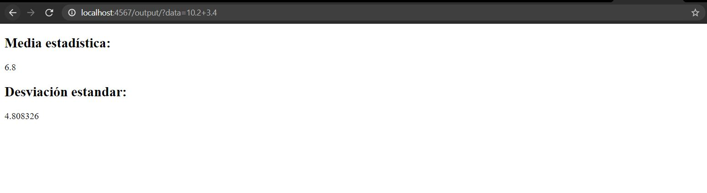
En esta prueba se ingresaron valores reales|

## TEST 3 
INPUT | OUTPUT
------------ | ------------- 
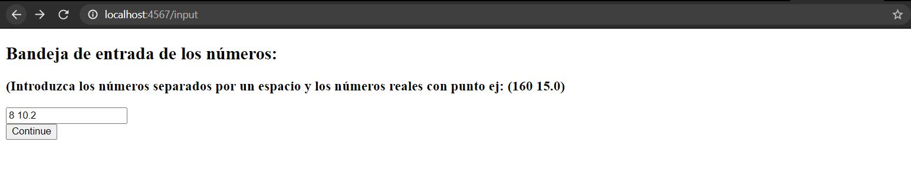 | 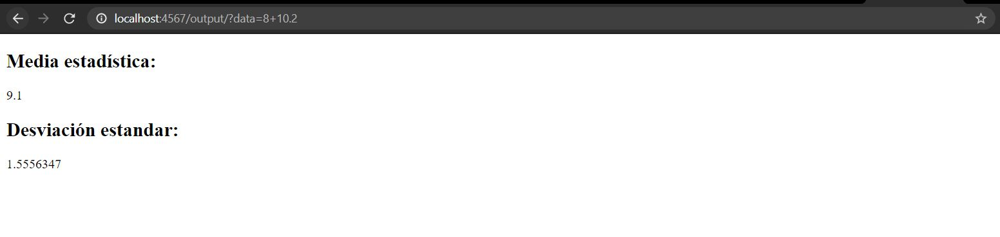
En esta prueba se ingresaro un valor entero y otro real (en ese orden)|

## TEST 4 
INPUT | OUTPUT
------------ | ------------- 
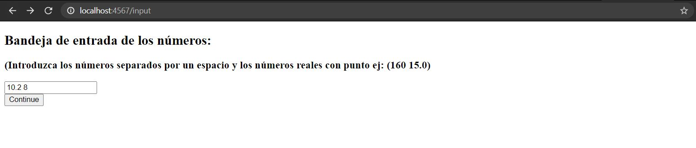 | 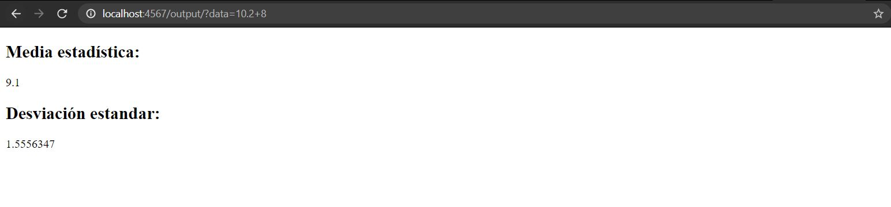
En esta prueba se ingresaron valor real y otro entero (en ese orden)|


## HEROKU
[tarea2-arep](https://tarea2-arep.herokuapp.com/input) - Link HEROKU

## BUILT

* [Maven](https://maven.apache.org/) - Dependency Management
* [JAVA JDK 8](http://www.oracle.com/technetwork/java/javase/overview/index.html) - Building
* [JUnit 3.8.1](https://mvnrepository.com/artifact/junit/junit/3.8.1) - Test
* [SPARK 2.9.1](http://sparkjava.com/download) - Web


## AUTHOR

* **JUAN CAMILO ORTIZ MEDINA** - [Juaco9502](https://github.com/juaco9502)


## LICENSE

This project is licensed under the GNU General Public License - [LICENSE](LICENSE) 